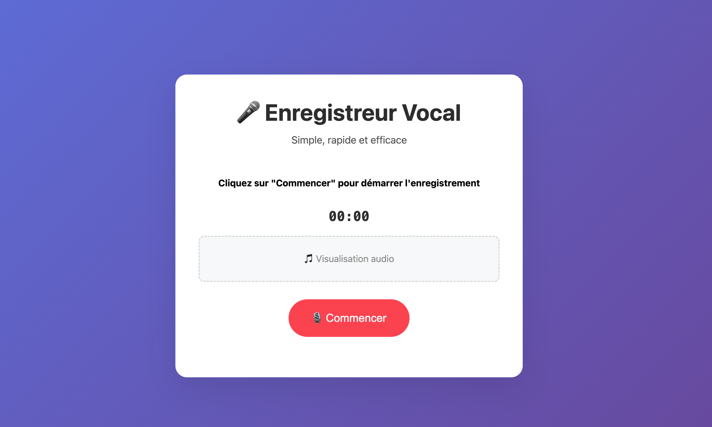
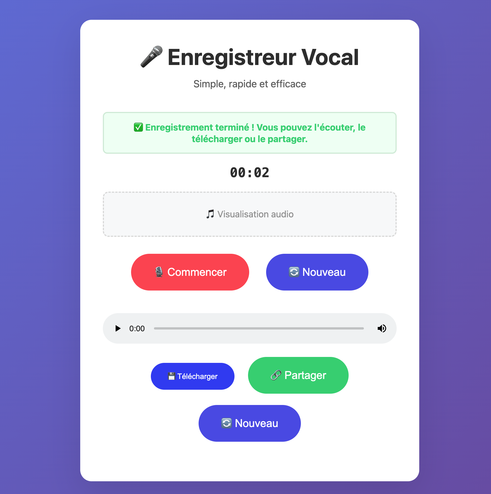

# 🎤 Enregistreur Vocal PHP - Simple & Efficace

Un enregistreur vocal minimaliste en PHP pur, sans framework, sans base de données complexe.

## 📸 Screenshots

<div align="center">

### Interface principale


### Interface d'enregistrement  


</div>

## ✨ Fonctionnalités

- 🎙️ **Enregistrement vocal** directement dans le navigateur
- ⏸️ **Pause/Reprise** pendant l'enregistrement  
- 🎵 **Visualisation audio** en temps réel pendant l'enregistrement
- 💾 **Sauvegarde** sur le serveur (fichiers + métadonnées JSON)
- 💬 **Commentaires/Notes** pour les vocaux partagés
- 🔗 **Partage** par URL unique et sécurisée (non-indexée)
- 📅 **Format de date français** (dd/mm/yyyy à HH:mm)
- 📱 **Responsive** - Fonctionne sur mobile et desktop
- 🔒 **Sécurisé** - Validation MIME, taille limitée, protection uploads

## 🚀 Installation

### Prérequis
- PHP 7.4+ (avec extension `fileinfo`)
- Serveur web (Apache, Nginx) ou serveur PHP intégré

### Démarrage rapide

```bash
# Cloner ou télécharger les fichiers
cd voicerecorder

# Créer le dossier uploads (si pas déjà fait)
mkdir uploads
chmod 755 uploads

# Serveur PHP intégré pour test
php -S localhost:9000

# Ou configurer Apache/Nginx
```

## 📁 Structure des fichiers

```
voicerecorder/
├── index.php          # Application principale
├── uploads/            # Dossier des enregistrements
│   ├── .htaccess      # Sécurité Apache
│   └── index.php      # Bloquer accès direct
└── README.md          # Ce fichier
```

## 🎯 Utilisation

1. **Enregistrer** : Cliquer sur "Commencer", parler, puis "Arrêter"
2. **Écouter** : Player audio intégré pour prévisualiser
3. **Télécharger** : Bouton de téléchargement local
4. **Sauvegarder** : Upload sur le serveur avec génération d'URL de partage
5. **Partager** : Copier l'URL générée pour partager l'enregistrement

## 🔧 Configuration

### Limites (dans `index.php`)
```php
$max_file_size = 10 * 1024 * 1024; // 10MB max
$allowed_mime_types = ['audio/wav', 'audio/mpeg', 'audio/ogg', 'audio/webm'];
```

### Sécurité
- Types MIME vérifiés côté serveur
- Taille de fichier limitée
- Noms de fichiers uniques (uniqid + timestamp)
- Dossier uploads protégé
- Métadonnées en JSON séparées

### Stockage
```
uploads/
├── 66d6789a123456_1725271234.wav     # Fichier audio
├── 66d6789a123456_1725271234.json    # Métadonnées
└── ...
```

## 📱 Compatibilité navigateurs

| Navigateur | Support |
|------------|---------|
| Chrome 60+ | ✅ Full |
| Firefox 55+ | ✅ Full |
| Safari 11+ | ✅ Full |
| Edge 79+ | ✅ Full |
| IE | ❌ Non supporté |

## 🚀 Déploiement

### Hébergement partagé
1. Uploader les fichiers via FTP
2. Vérifier que PHP 7.4+ est installé
3. Créer le dossier `uploads` avec chmod 755

### VPS/Serveur dédié
```bash
# Apache
<VirtualHost *:80>
    DocumentRoot /var/www/voicerecorder
    ServerName votre-domaine.com
</VirtualHost>

# Nginx
server {
    listen 80;
    server_name votre-domaine.com;
    root /var/www/voicerecorder;
    index index.php;
    
    location ~ \.php$ {
        fastcgi_pass 127.0.0.1:9000;
        fastcgi_param SCRIPT_FILENAME $document_root$fastcgi_script_name;
        include fastcgi_params;
    }
}
```

## 🎨 Personnalisation

### Couleurs (CSS dans `index.php`)
```css
.record-btn { background: #ff4757; }      /* Bouton enregistrer */
.pause-btn { background: #ffa502; }       /* Bouton pause */
.save-btn { background: #2ed573; }        /* Bouton sauvegarder */
```

### Durée max d'enregistrement (JavaScript)
```javascript
if (elapsed >= 120) {  // 2 minutes par défaut
    stopRecording();
}
```

## 🔒 Sécurité

- ✅ Validation MIME côté serveur
- ✅ Limitation taille de fichier
- ✅ Noms de fichiers sécurisés
- ✅ Dossier uploads protégé
- ✅ Headers de sécurité
- ✅ Pas d'exécution PHP dans uploads/

## 📊 Métriques

- **Fichier unique** : ~50KB (HTML + CSS + JS + PHP)
- **Pas de dépendances** externes
- **Compatible** PHP 7.4 à 8.x
- **Performance** : Excellent sur tous serveurs

## 🆘 Support

### Problèmes courants

**"Impossible d'accéder au microphone"**
→ Autoriser l'accès microphone dans le navigateur

**"Erreur lors de la sauvegarde"**  
→ Vérifier les permissions du dossier `uploads/` (755)

**"Type de fichier non autorisé"**
→ Le navigateur utilise un format non supporté (normal sur certains navigateurs)

## ⚖️ Licence

MIT License - Libre d'utilisation et modification

---

**Auteur :** EL GNANI Mohamed

🎤 **Simple. Efficace. Sans dépendances.**